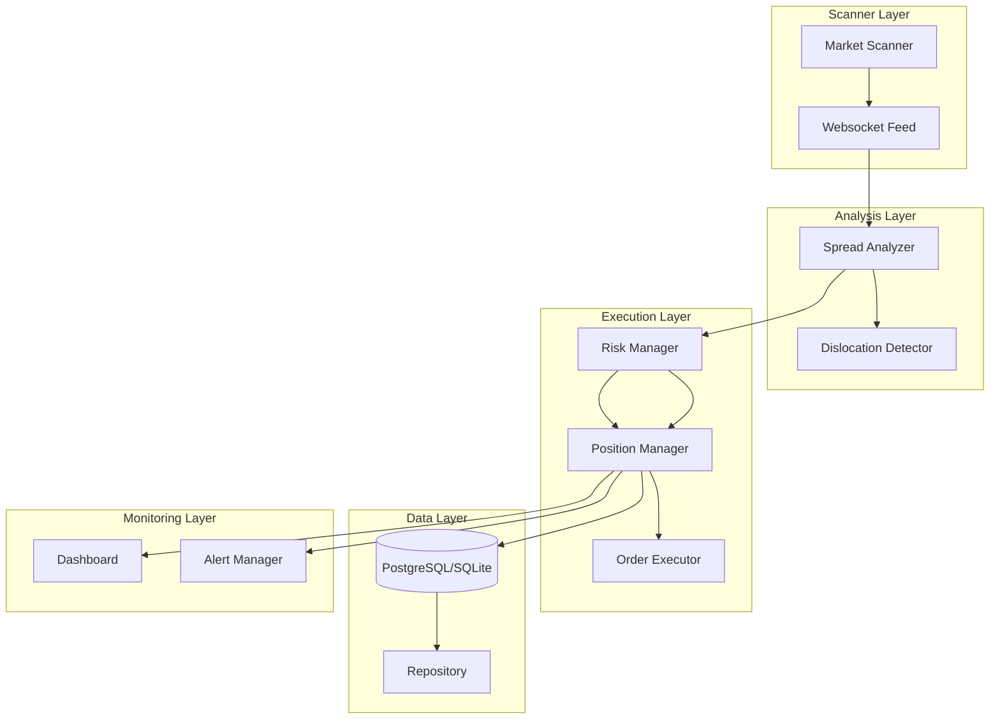

# System Architecture

The Polybot is built as a highly modular, asynchronous Python application designed for low-latency market monitoring and execution.

## High-Level Diagram

## Core Components

### 1. Scanner Layer (`src/scanner`)
- **MarketScanner**: Fetches active markets from Polymarket Gamma API, filtering for specific types (e.g., 15-min crypto flash markets).
- **WebsocketFeed**: Maintains a real-time connection to the CLOB for instantaneous order book updates.

### 2. Detection Layer (`src/detector`)
- **SpreadAnalyzer**: Calculates the synthetic spread between UP and DOWN tokens.
- **DislocationDetector**: Identifies sudden price movements that might signal an arbitrage opportunity before the broader market reacts.

### 3. Trading Layer (`src/trading`)
- **ArbitrageStrategy**: The orchestrator that ties scanning, detection, and execution together.
- **PositionManager**: Tracks delta-neutral pairs, manages entry/exit state, and calculates P&L.
- **OrderExecutor**: Handles the low-level API calls to Polymarket CLOB, supporting both live and paper trading.

### 4. Risk Layer (`src/risk`)
- **RiskManager**: Enforces global and per-trade limits (e.g., max exposure, max position size).
- **Validators**: Pre-trade checks to ensure market conditions meet safety criteria.

### 5. Monitoring Layer (`src/monitoring`)
- **PnLTracker**: Real-time performance tracking with daily snapshots.
- **AlertManager**: Sends notifications via Telegram for critical events.
- **Dashboard**: A Rich-based console UI for real-time human oversight.

### 6. Database Layer (`src/db`)
- **SQLAlchemy ORM**: For persisting trades, positions, and snapshots to ensure the bot can recover state after a restart.
