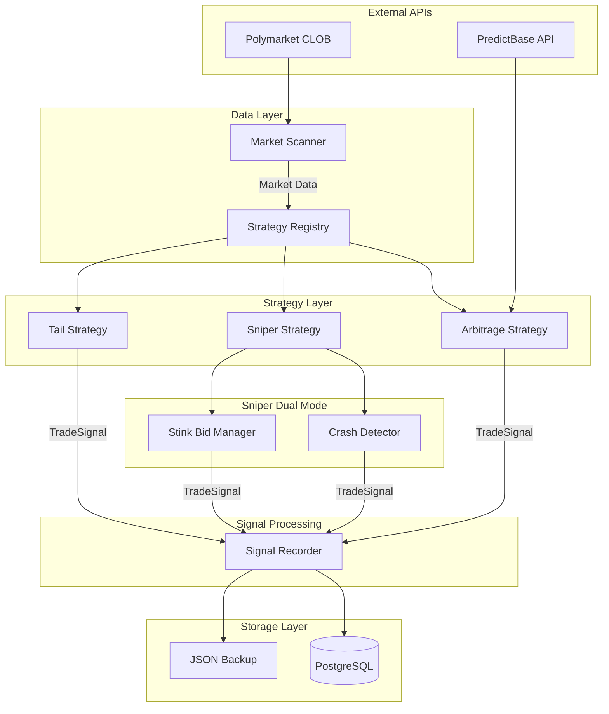

# System Architecture

Sistema **multi-estrategia** con arquitectura basada en Strategy Pattern que permite ejecutar múltiples estrategias de trading en paralelo sobre un único flujo de datos.

## High-Level Diagram



## Core Components

### 1. Strategy Layer (`src/trading/strategies/`)

**BaseStrategy (ABC)**
```python
class BaseStrategy(ABC):
    @abstractmethod
    async def process_market(self, market: MarketData) -> Optional[TradeSignal]:
        pass
```

**Estrategias Implementadas:**

| Clase | ID | Función |
|-------|-----|---------|
| `ArbitrageStrategy` | `ARB_PREDICTBASE_V1` | Cross-exchange entre Polymarket y PredictBase |
| `SniperStrategy` | `SNIPER_MICRO_V1` | Dual mode: Crash Detection + Stink Bids |
| `TailStrategy` | `TAIL_BETTING_V1` | Tail betting con ML scoring |

### 2. Sniper Dual Mode Architecture

```python
class SniperStrategy(BaseStrategy):
    # MODE 1: Reactive - detecta caídas y compra el dip
    async def _process_crash_detector(self, market) -> Optional[TradeSignal]:
        # Mantiene PriceBuffer de 5 min
        # Detecta drops > 15% con volume spike
    
    # MODE 2: Proactive - coloca trampas a precios bajos
    async def _consider_stink_bid(self, market) -> Optional[TradeSignal]:
        # Coloca bids en $0.02-$0.05
        # TTL de 30 min con rotación
```

**StinkBid Lifecycle:**
```
1. PLACEMENT → Bid colocado en mercado de alto volumen
2. MONITORING → Espera flash crash
3. FILL → Precio toca bid → Filled
4. EXIT → Sale en rebound automático
5. EXPIRY → Si no fill en 30 min → Rotación
```

### 3. Data Models (`src/db/multi_strategy_models.py`)

```python
class Trade(Base):
    id: int
    strategy_id: str          # "SNIPER_MICRO_V1"
    condition_id: str
    outcome: str
    entry_price: float
    stake: float
    paper_mode: bool
    signal_data: JSON         # Trigger reason, mode
    snapshot_data: JSON       # Market state (for ML training)
    status: TradeStatus       # PENDING → FILLED → RESOLVED
```

### 4. Orchestrator (`scripts/multi_strategy_daemon.py`)

```python
async def main_loop():
    scanner = MarketScanner()
    registry = StrategyRegistry()
    
    # Registrar estrategias
    registry.register(ArbitrageStrategy())
    registry.register(SniperStrategy())
    registry.register(TailStrategy())
    
    while True:
        markets = await scanner.scan()
        
        for market in markets:
            # Evaluar con TODAS las estrategias
            signals = await registry.process_all(market)
            
            for signal in signals:
                await record_trade(signal, paper_mode=True)
        
        await asyncio.sleep(60)
```

### 5. External Integrations

| API | Cliente | Uso |
|-----|---------|-----|
| Polymarket Gamma | `MarketScanner` | Fetch mercados activos |
| Polymarket CLOB | `OrderExecutor` | Order book, execution |
| PredictBase | `PredictBaseClient` | Cross-exchange arbitrage |

**PredictBase Client** (`src/exchanges/predictbase_client.py`):
- Intenta API descubierta primero
- Fallback a scraper si falla
- Fuzzy matching para emparejar mercados

### 6. Storage Strategy

**Dual Storage para Resiliencia:**
1. **PostgreSQL**: Primary storage en VPS
2. **JSON Backup**: Secondary storage local

```python
# Save to both
await save_to_postgres(signal)
append_to_json(signal, "data/signals_backup.json")
```

## Deployment Architecture

```
┌──────────────────────────────────────┐
│           VPS (Ubuntu)               │
│          94.143.138.8                │
├──────────────────────────────────────┤
│  systemd: multi-strategy-bot.service │
│  ├── scripts/multi_strategy_daemon.py│
│  └── Interval: 60s, Restart: always  │
├──────────────────────────────────────┤
│  PostgreSQL                          │
│  └── Database: polymarket            │
│      ├── strategies                  │
│      ├── trades                      │
│      ├── market_snapshots            │
│      └── strategy_performance        │
└──────────────────────────────────────┘
```

## Memory Optimization

Para VPS con 512MB RAM:
- GC forzado cada 10 ciclos
- No mantener historial en memoria
- PostgreSQL como source of truth
